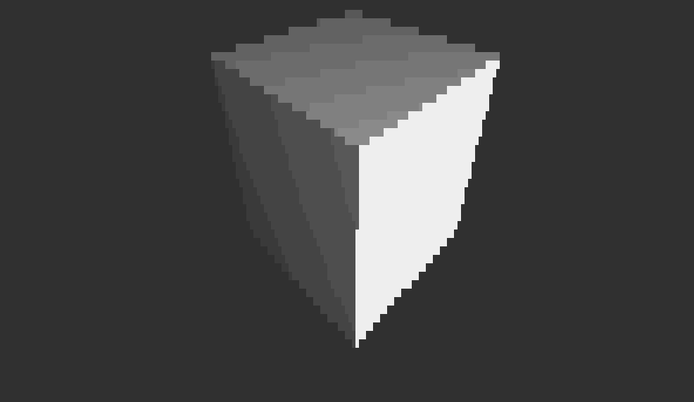
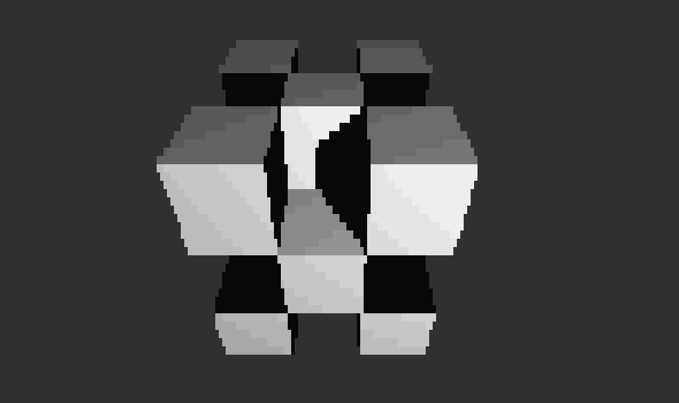

# nixlang-raytracer

A simple raytracer written in the [Nix configuration language](https://nixos.org/manual/nix/stable/language/index.html) using the standard library (`builtins` and `lib`). It renders to the terminal using Unicode block characters, but I plan to adapt it to generate actual images (at some point). Currently, the renderer can handle scenes containing meshes with convex faces (though the mesh itself need not be convex) (these are triangulated at render time) and point light sources. [Möller–Trumbore](https://en.wikipedia.org/wiki/M%C3%B6ller%E2%80%93Trumbore_intersection_algorithm) is used for ray-triangle intersection when rendering meshes. [Phong shading](https://en.wikipedia.org/wiki/Phong_reflection_model) is used by default. As Nix lacks trig function builtins/intrinsics, sine and cosine are approximated using [Taylor series](https://en.wikipedia.org/wiki/Taylor_series#Trigonometric_functions); similarly, [Newton's method](https://en.wikipedia.org/wiki/Newton%27s_method#Square_root) is used to approximate  `sqrt`.

## Usage

An example scene description (lighting, camera, objects, rendering settings) is given in `scene.nix`, with the renderer itself in `renderer.nix` and `utils.nix` (miscellaneous helper functions and geometry tools). Most of the settings should be self-evident, but those that may not be are (hopefully) commented. No particular units are imposed on geometry/focal length/other distances.

In ANSI mode (`scene.camera.useANSI == true`), something like the following can be used to render a single frame to the terminal (if the setting is disabled, the `printf` invocation can be omitted since there are no escape codes to interpret):

```sh
printf "%b\n" $(nix --extra-experimental-features nix-command eval --impure --expr "(import ./renderer.nix) { scene' = ./scene.nix; }" --raw)
```

As far as I'm aware, Nix does not have a way to pause execution for a specified length of time (though printing is possible using, e.g. `builtins.trace`), and the renderer is currently far too slow to run in real time at a reasonable resolution -- so the best option for creating animations is probably pre-rendering via the below shell commands (or something similar):

```sh
nix --extra-experimental-features nix-command eval --impure --expr "let R = import ./renderer.nix; lib = import <nixpkgs/lib>; in lib.concatStringsSep ''\n'' (builtins.genList (t: R { scene' = ./scene.nix; sceneParams = { inherit t; }; }) 60)" --raw --show-trace > test-animation
for i in {1..2}; do a=$(cat ./test-animation); n=50; for j in {1..60}; do printf "%b\n" $(head -n$n <<< "$a"); sleep 0.1; a=$(tail -n +$n <<< "$a"); done; done
```

This generates 60 frames by passing the timestep/index of each to the function in `scene.nix`, concatenating the results and writing the frames to `test-animation`. The second line reads back each frame, with delays interspersed. Note that `n` should be updated with the y-resolution, as set in `scene.nix` or equivalent.

## Gallery

(See the `objects` field in `scene.nix` for the definitions of these objects and the lighting and camera configuration)





## Benchmarks

TODO
